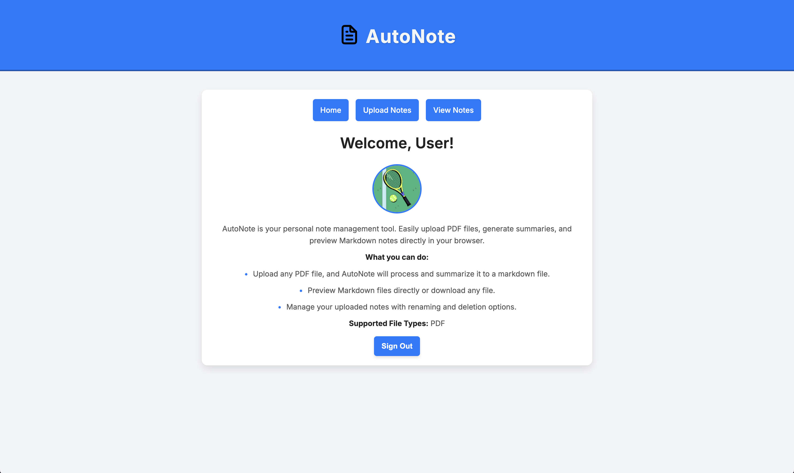
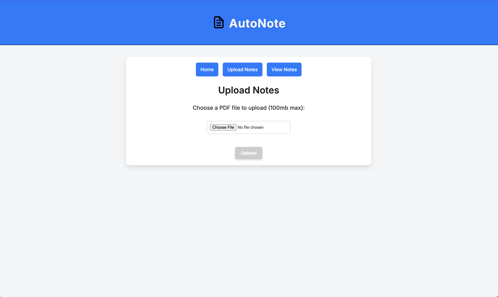
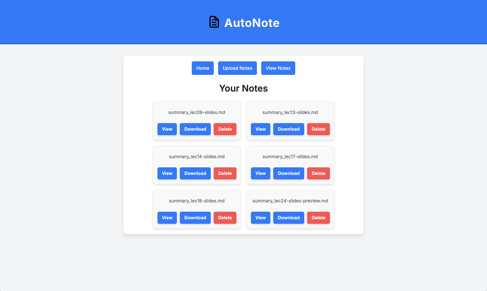

# AutoNote

AutoNote is a web app built with [React](https://react.dev/) and [Express](https://expressjs.com/) that allows users to upload PDF files, automatically generate summarized notes in Markdown format, and view or manage their uploaded notes.

The website uses [Firebase](https://firebase.google.com/) to authenticate users and storing data, and [OpenAI](https://platform.openai.com/docs/overview) to summarize notes.





## Features

**1. User Authentication:**
- Users can sign in using Google authentication.
- Only signed-in users can upload, view, and manage notes.

**2. Upload Notes:**
- Upload PDF files.
- AutoNote extracts the text content from the uploaded file and summarizes it using OpenAI GPT (gpt-4o-mini).
- Generates a Markdown file containing the summary.

**3. View Notes:**
- Lists all uploaded notes.
- Allows users to:
    - View Notes: Opens the Markdown or file content in a popup.
    - Download Notes: Downloads the selected file.
    - Delete Notes: Remove notes from the storage.

**4. Responsive Design:**
- A clean and modern interface designed to be user-friendly and accessible across different devices.
- Displays Markdown content in a readable format directly within the application.

# Getting Started

## Prerequisites
- Node.js and npm/pnpm
- A Firebase project with:
    - Firestore enabled
    - Storage bucket configured
    - Service account credentials
    - Google Authentication configured
- An OpenAI API Key

## Installation and Running

**1. Clone the Repository:**

```
git clone https://github.com/arsh-s/AutoNote.git
cd AutoNote
```
**2. Install Dependencies:**

Use pnpm (or npm/yarn) to install the required dependencies for both client and server:
```
pnpm install
```

**3. Set Environment Variables:**

Create a `.env` file in the root directory with the following:

- `OPENAI_API_KEY`, from your OpenAI Api key"
- `FIREBASE_SERVICE_ACCOUNT`, from your Firebase service account file, named `service_account.json`.
- `PORT`, default is 5174.

**4. Start the Server:**

Navigate to the both the server and client directory and start them:
```
pnpm dev
```

## Tech Stack
- Frontend: React, TypeScript, Vite, React Markdown
- Backend: Node.js, Express, Firebase, OpenAI API
- Authentication: Firebase Authentication
- Storage: Firebase Storage
- Summarization: OpenAI GPT API
- PDF Parsing: pdfjs-dist

## Deployment

AutoNote is deployed on [Fly.io](https://fly.io/).

The currently deployment is available at [AutoNote](https://autonote.fly.dev/) (Note: Backend functionality is still under development as of 12/5).

## Author

Developed by **Arsh Singh** as a Final Project for **Info 1998: Trends in Web Development**

> Thanks to [Trends in Web Dev](https://webdev.cornelldti.org/) course for teaching full-stack development and credit to [their github](https://github.com/cornell-dti/trends-mono/tree/main/frontend-starter) for the frontend template.
